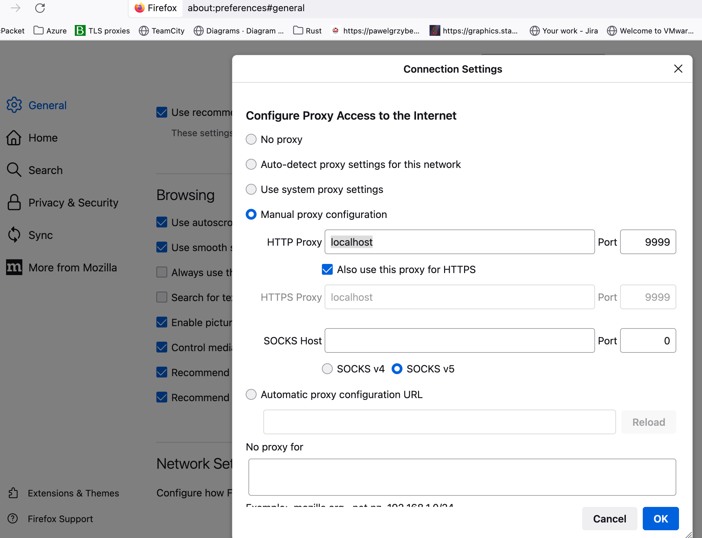

# dropstep

> Download the ads but do not view them

## Why?

This is at best a strange idea: prefer [pi-hole][pi-hole] or another ad blocking solution that prevents blocked content from being downloaded.

Here, you're still paying for the bandwidth, even though the ads are not passed to your browser.

Why bother?
I wanted to learn about network proxies, TLS, and do some Go programming.

Also, I generally don't want to see ads.
They clutter up a web page and distract from what I am reading or researching.

However, advertisement pays for much of the content on the web.
Let's not punish the publishers: download the ad, but shelve it in a directory for inspection later, or never.

It's also neat to find out how much bandwith online ads are consuming and what kind of content is provided.

## What?

This is a proxy server that you point your browser to.
It's a Man-in-the-middle (MITM): it intercepts requests from your browser to servers on the internet, and intercepts the responses on the way back.

I use Firefox on MacOS.
Under Firefox > Settings > Network Settings, select "Manual proxy configuration".

In  the "HTTP Proxy" text box, enter "localhost" and enter the port that you want to use for the proxy.



## How?

When the proxy receives a response from the server, it checks a dynamically updated list of advertisement domains.
If the response comes from an ad domain, it saves the content to a file but does not hand it down to the client.

I'm relying on the excellent [goproxy] for all the MITM functionality.

You will also need to be your own Certificate Authority.
For this, I used the wonderful [mkcert][mkcert].

```bash
mkcert -install # installs the certs
```

### Installing mkcert on MacOS and Firefox

```bash
brew install mkcert
brew install nss # if you use Firefox
```

### Run

```bash
dropstep -l localhost:9999 -v 2>&1 | tee ~/Downloads/logs/dropstep.log
```

### Build

```bash
go build
```

## References

There is a really great [series of articles on Golang network proxies][greenplace].

[goproxy]: https://github.com/elazarl/goproxy
[pi-hole]: https://pi-hole.net/
[mkcert]: https://github.com/FiloSottile/mkcert
[greenplace]: https://eli.thegreenplace.net/2022/go-and-proxy-servers-part-2-https-proxies/
